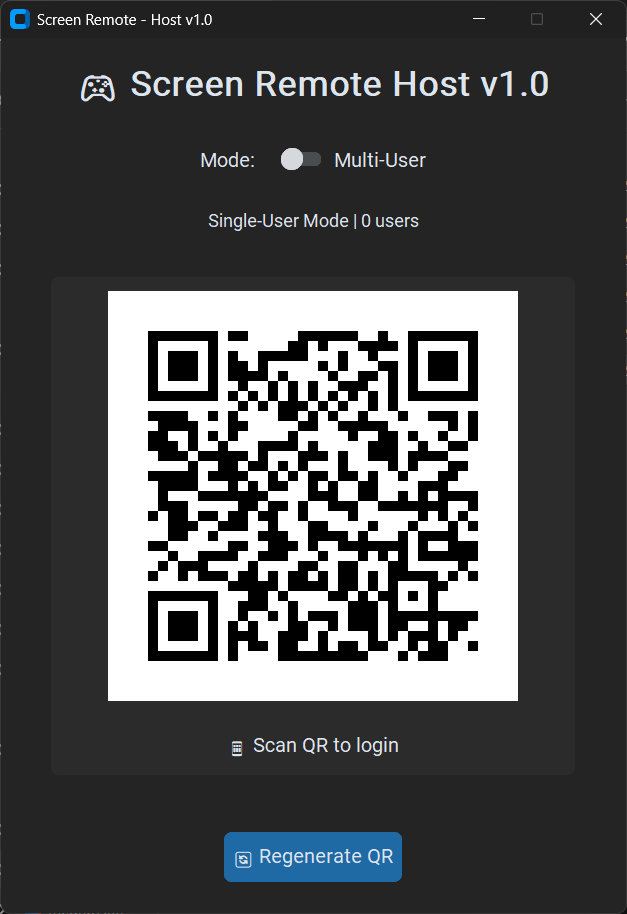

# 🎮 Screen Remote – QR-Based Desktop Media Controller

A QR-based desktop media controller built with **Flask, CustomTkinter, and PyAutoGUI** that allows you to control your PC's media playback directly from your phone.

Scan a QR code, connect instantly, and control your desktop media securely over your local network.

---

## 🚀 Overview

Screen Remote is a desktop-hosted application that generates a secure QR login link.  
Once scanned from a mobile device, it provides a web-based controller to manage media playback and system-level shortcuts on the host machine.

The project combines:

- Flask (Web Backend)
- CustomTkinter (Desktop Host UI)
- PyAutoGUI (OS Automation)
- QR-based Authentication
- Session-based Access Control

---

## 📸 Screenshots

### 🖥 Host Interface (QR Generation + Mode Control)



### 📱 Mobile Controller Interface


---

## ✨ Features

- 🔐 QR-based secure login
- 👤 Single-user mode (restricted access)
- 👥 Multi-user mode (shared control)
- 📱 Mobile-friendly control interface
- 🎬 Media playback controls (Play/Pause, Volume, Seek)
- 🎵 VLC-specific shortcut handling
- 🖥 Desktop-level automation using PyAutoGUI
- 🔄 Regeneratable secure session passwords
- 🏷 Versioned release system (v1.0)

---

## 🛠 Technologies Used

- Python
- Flask
- CustomTkinter
- PyAutoGUI
- Pillow
- qrcode
- HTML / CSS (Jinja templates)

---

## 📦 Installation (From Source)

### 1️⃣ Clone the Repository

```bash
git clone https://github.com/YOUR_USERNAME/screen-remote-qr-desktop-media-controller.git
cd screen-remote-qr-desktop-media-controller
```

### 2️⃣ Install Dependencies

```bash
pip install -r requirements.txt
```

### 3️⃣ Run the Application

```bash
python app.py
```

The host window will open and display a QR code.

---

## 💻 Windows Executable

You can download the pre-built Windows executable from the **Releases** section:

👉 Go to **Releases → v1.0 → Download .exe**

No Python installation required.

---

## 📱 How to Use

### Step 1 – Start the Host Application
Run the `.exe` file or execute:

```bash
python app.py
```

The desktop host window will appear.

---

### Step 2 – Scan the QR Code
- Open your phone camera.
- Scan the QR code displayed on the host window.
- You will be redirected to the login page.

⚠️ Make sure your phone and PC are connected to the same WiFi network.

---

### Step 3 – Login & Connect
- The QR link contains a secure session password.
- After login, you will see the media control interface.

---

### Step 4 – Control Media

You can now control:

- ▶ Play / Pause
- 🔊 Volume Up / Down / Mute
- ⏩ Forward / Backward
- 🔄 Reload
- ⛶ Fullscreen
- 🎵 Audio Track (VLC)
- 📝 Subtitle Toggle
- ⏱ Playback Speed
- ⏮ Previous / Next

---

### Step 5 – Mode Switching

From the Host UI:

**Single-User Mode**
- Only one device can stay connected.
- QR hides after first login.

**Multi-User Mode**
- Multiple devices can connect simultaneously.
- QR remains visible.

---

## 🔒 Security Model

- Each session receives a unique token.
- Access is validated per request.
- Sessions are restricted in single-user mode.
- QR-based temporary password system.

This ensures controlled access over the local network.

---

## 🧠 Architecture Overview

The application runs:

- Flask server in a background thread
- CustomTkinter host UI in the main thread
- Session-based access validation
- OS-level automation using PyAutoGUI

The host machine acts as both:
- Web server
- Automation controller

---

## 📌 Project Structure

```
screen-remote-qr-desktop-media-controller/
│
├── app.py
├── requirements.txt
└── templates/
    ├── base.html
    ├── controller.html
    └── login.html
```

---

## 🏁 Release

**Current Version:** v1.0  
**Release Type:** Initial Public Release  
**Platform:** Windows  

---

## 🔮 Future Improvements

- HTTPS support
- Dynamic port configuration
- Cross-platform packaging
- Improved UI animations
- Authentication timeout handling
- Docker support

---

## 👨‍💻 Author

Developed as a portfolio project demonstrating:

- Full-stack integration
- Desktop + Web hybrid architecture
- Session management
- Secure local automation
- Product-level versioning and release handling

---

## ⭐ Support

If you like this project, consider starring the repository.
